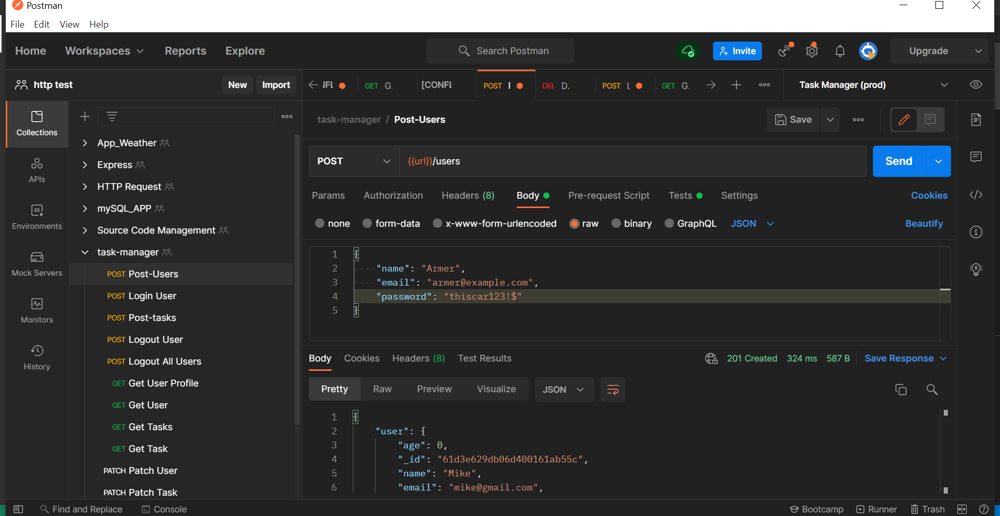
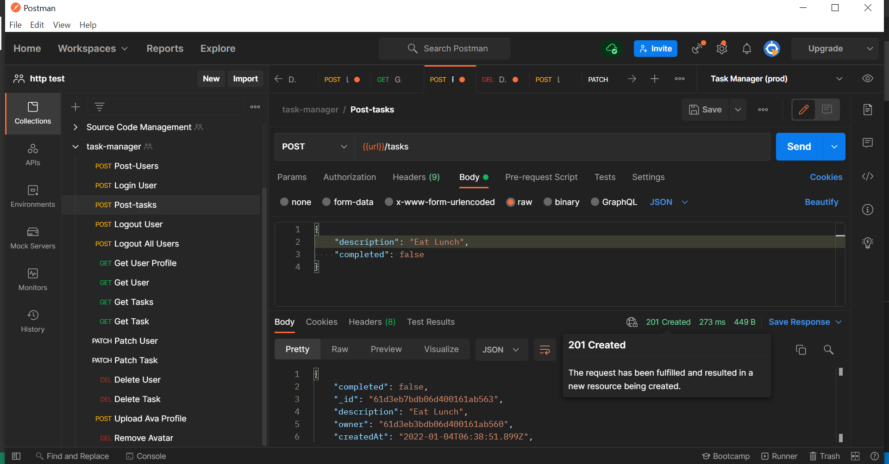

# Task-Manager API





> Track your activities

---

### Table of Contents

You're sections headers will be used to reference location of destination.

- [Description](#description)
- [How To Use](#how-to-use)
- [References](#references)
- [Author Info](#author-info)

---

## Description

API for task manager. it builds to manage personal tasks. Don't worry about your data in API, your tasks can't be accessed from another users in API, protect the data before it saved in database. User can keep in touch the task day-to-day. [Try in your Postman](https://ariya-task-manager.herokuapp.com/).

#### Technologies

- JWT
- Express
- Node JS
- Jest
- MongoDB
- Postman

[Back To The Top](#read-me-template)

---

## How To Use

#### Installation

```html
npm init
```

#### Run script

```html
npm start
```

[Back To The Top](#read-me-template)

---

## References

- [Validator](https://www.npmjs.com/package/validator)
- [Mongoose](https://mongoosejs.com/docs/api.html)
- [Nodemailer](https://nodemailer.com/message/)
- [Sharp](https://www.npmjs.com/package/sharp)
- [Multer](https://www.npmjs.com/package/multer)
- [Bcrypt.js](https://www.npmjs.com/package/bcryptjs)

[Back To The Top](#read-me-template)

---

## Author Info

- Twitter - [@armerayfrndy](https://twitter.com/armerayfrndy)
- LinkedIn - [@armeray](https://www.linkedin.com/in/armer-ray-aa1b2411b/)

[Back To The Top](#read-me-template)
